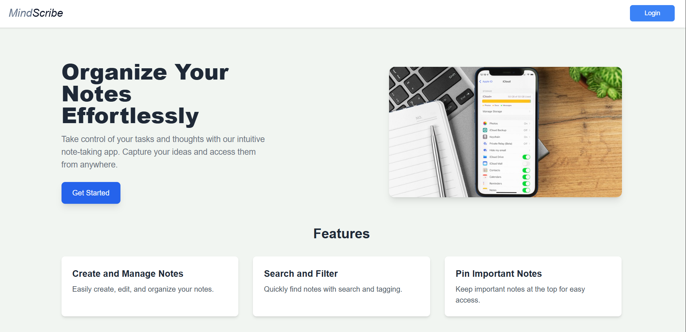
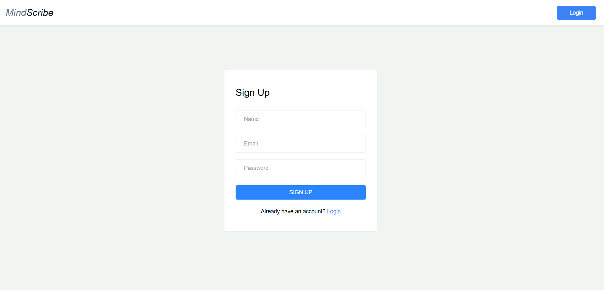
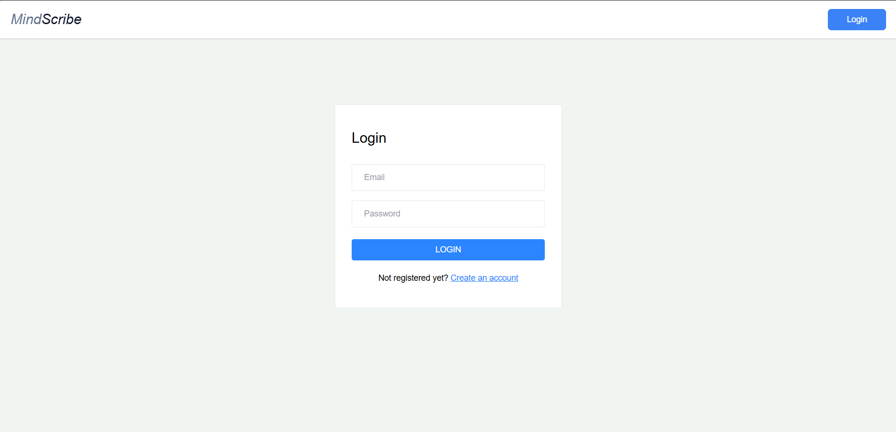
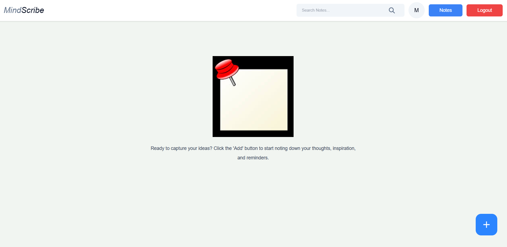
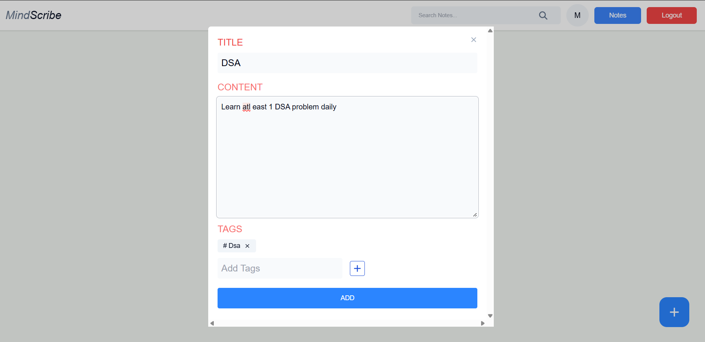
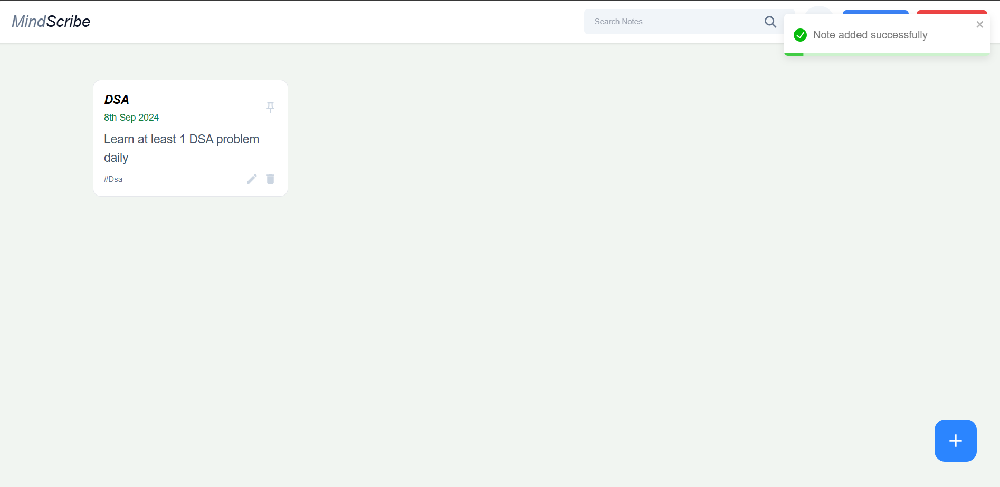

# MindScribe

MindScribe is an intuitive and feature-rich note-taking application designed to help users efficiently organize, manage, and access their notes. Built with modern technologies, it provides a seamless experience for creating, editing, pinning, and searching through your notes.

## Features

- **Create and Manage Notes**: Easily create, edit, and delete notes.
- **Pin Important Notes**: Pin notes to the top for quick access.
- **Search Functionality**: Search notes by title, content, or tags to quickly find what you're looking for.
- **Tagging System**: Organize your notes with customizable tags.
- **Responsive Design**: Fully responsive, ensuring smooth usage across all devices.
- **Security**: JWT-based authentication ensures your notes are safe and accessible only to you.
- **User Authentication**: Secure login, signup, and signout functionalities.
- **Notifications**: Toast notifications for user feedback on actions such as note creation, update, and deletion.
- **Animations**: Smooth animations using Motion-Frame to enhance user experience.

## Tech Stack

- **Frontend**: React, Tailwind CSS
- **Backend**: Node.js, Express.js
- **Database**: MongoDB
- **Authentication**: JWT (JSON Web Tokens)
- **Styling**: Tailwind CSS for beautiful and responsive design
- **Notifications**: Toast for notifications
- **Animations**: Motion-Frame for animations
- **Version Control**: Git

## Installation

Follow the steps below to set up and run the project on your local machine:

### Prerequisites

- Node.js installed
- MongoDB instance running locally or a MongoDB Atlas account
- A code editor like VSCode

### Step 1: Clone the repository

```bash
git clone https://github.com/ms-maheswari/mindscribe.git
cd mindscribe
```

### Step 1: Clone the repository

```bash
git clone https://github.com/ms-maheswari/mindscribe.git
cd mindscribe
```

### Step 2: Install dependencies
Navigate into both the backend and frontend folders and install the necessary dependencies.

Backend (Server)

```bash
cd server
npm install
```

Frontend (Client)

```bash
cd client
npm install
```

### Step 3: Set up environment variables
Create a .env file in the server directory and add the following:

```bash
MONGO_URI=<Your MongoDB Connection String>
JWT_SECRET=<Your JWT Secret Key>
NODE_ENV=development
PORT=5000
```

### Step 4: Run the application
In separate terminal windows, run the following commands for the backend and frontend.

Backend (Server)

```bash
cd server
npm start
```

Frontend (Client)

```bash
Copy code
cd client
npm start
```

By default, the backend runs on http://localhost:5000 and the frontend runs on http://localhost:3000.

### Usage
- Sign up or log in to your account.
- Once logged in, you can create, edit, delete, pin, and unpin notes.
- Use the search bar to filter notes based on titles, content, or tags.
- Enjoy real-time updates on your notes with the upcoming notification feature.

## Screenshots

This is the Home page that contains navbar and landing page



This is the signup page



This is the login page



This is the page where we can see all our notes but by default it is empty



This is the form to add notes by click on the +button on the home page



The available notes are visible here



